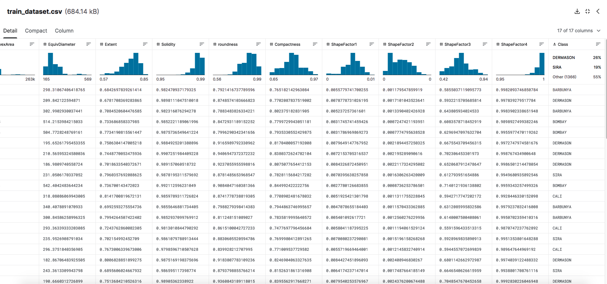

Dataset
--

I will be using the dataset on Dry Bean Classification found on Kaggle with a creative Commons Public Domain License

(https://www.kaggle.com/datasets/gauravduttakiit/dry-bean-classification?select=train_dataset.csv)

"A computer vision system was developed to distinguish seven different registered varieties of dry beans with similar features in order to obtain uniform seed classification. Seven different types of dry beans were used in this research, taking into account the features such as form, shape, type, and structure by the market situation. For the classification model, images of 13,611 grains of 7 different registered dry beans were taken with a high-resolution camera. Bean images obtained by computer vision system were subjected to segmentation and feature extraction stages, and a total of 16 features; 12 dimensions and 4 shape forms, were obtained from the grains."

1. It has 2 tables, one for testing and one for training.
2. It has 17 columns. 
3. It has 16 columns with numerical values (information on the bean it scanned) and 1 categorical value (the type of bean)
4. The output column would be a categorical column, the type of the bean. The AI will learn to categorize beans based on the inputs given.
5. It has 2500 rows

This meets every requirement for the dataset EXCEPT the categorical one. All the input in this scenario is numerical, and the output is a single categorical. Im hoping this will still be 
accepted despite being slightly off the requirements, because this seems like a really fun model to train.

